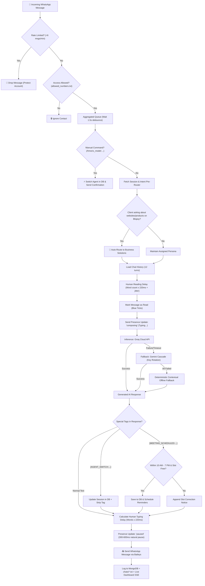

# 🚀 HMorix WhatsApp Multi-Agent System — Architecture & Workflow Guide

> **Enterprise WhatsApp Automation & Multi-Agent Orchestration Platform**  
> Developed for **HMorix** (https://hmorix.in) | Founded by **Harsh Sharma**

---

## 📑 Table of Contents
1. [System Overview & Architecture](#1-system-overview--architecture)
2. [End-to-End Workflow Diagram](#2-end-to-end-workflow-diagram)
3. [WhatsApp Connection & Socket Lifecycle](#3-whatsapp-connection--socket-lifecycle)
4. [Dual-Provider AI Engine (Groq + Gemini Cascade)](#4-dual-provider-ai-engine)
5. [Multi-Agent Routing & Handoff Mechanism](#5-multi-agent-routing--handoff-mechanism)
6. [Smart Meeting & Interview Scheduling System](#6-smart-meeting--interview-scheduling-system)
7. [Automated Reminder Cron Worker (2h / 1h / 15m)](#7-automated-reminder-cron-worker)
8. [Anti-Ban & WhatsApp Protection Guard](#8-anti-ban--whatsapp-protection-guard)
9. [API Calls & Endpoint Reference](#9-api-calls--endpoint-reference)
10. [Operational Do's and Don'ts](#10-operational-dos-and-donts)

---

## 1. System Overview & Architecture

The HMorix WhatsApp Automation Platform is a high-throughput, fault-tolerant Node.js service powered by **Baileys (WebSockets)**, multi-tier LLM inference (**Groq Cloud + Google Gemini**), dual storage persistence (**MongoDB Atlas + Local JSON fallback**), and an integrated **Real-Time Web Dashboard**.

### Core Architecture Components:
* **Connection Layer**: `@whiskeysockets/baileys` multi-device WebSockets with state caching, single-socket lifecycle, and automatic restart handling.
* **Intelligent Routing Layer**: Intent-based semantic pre-routing + dynamic model-driven handoff with session persistence in MongoDB `ContactSession`.
* **Inference Engine**:
  * Primary: Groq Cloud API (Llama 3.3 70B, Llama 3.1 8B, Qwen 3.8 27B) with model discovery and selective `reasoning_effort`.
  * Secondary: Google Gemini API cascade (`gemini-3.5-flash-lite`, `gemini-flash-latest`, `gemini-2.5-flash`) with multi-key round-robin rotation.
  * Tertiary: Offline contextual fallback messages.
* **Scheduling & Reminders**: Slot conflict protection (20-minute gap), 10:00 AM – 7:00 PM business hours guard, reschedule handler, and 2h/1h/15m proactive WhatsApp reminders.
* **Human Emulation & Anti-Ban**: Reading delay calculator, typing status simulator (`composing`), human jitter variance (85%-115%), burst rate-limiting, and 11:00 PM automatic nighttime rest shutdown.
* **Dashboard & Monitoring**: Native HTTP + SSE (Server-Sent Events) live log streamer, QR code regenerator, contact inspector, and interview scheduler UI at port 3000.

---

## 2. End-to-End Workflow Diagram



---

## 3. WhatsApp Connection & Socket Lifecycle

The socket manager (`index-baileys.js`) connects to WhatsApp Web Multi-Device servers via secure WebSockets:

* **Session Persistence**: Auth state is saved in `./baileys_auth`. Re-pairing is never needed unless the session is revoked from the primary phone.
* **Dynamic WA Web Version**: Fetches the newest browser release from GitHub (`@whiskeysockets/baileys`) with local fallback to prevent outdated version handshakes.
* **Keep-Alive Interval**: Set to `25,000ms` (25 seconds) to ensure Android Doze mode does not terminate background TCP connections.
* **Error Handling & Auto-Recovery**:
  * **Code 428 (Precondition Required)**: WhatsApp mobile disconnect. Handled with an exponential backoff (8s) reconnect cycle.
  * **Code 515 (Restart Required)**: Internal WhatsApp stream refresh. Handled with an instant 3s clean reconnect.
  * **Code 401 (Logged Out)**: Auth directory is purged and clean QR code is generated.
* **Single Socket Guard**: Uses atomic checks (`isConnecting`, `currentSocket?.end()`) to prevent multiple concurrent WebSockets running on the same auth directory.

---

## 4. Dual-Provider AI Engine

```
+-------------------------------------------------------------------------+
|                              AI ENGINE                                  |
|                                                                         |
|  Tier 1: Groq Cloud (Free Tier - 14,400 calls/day, ultra-fast 300 t/s) |
|  Models: llama-3.3-70b-versatile, llama-3.1-8b-instant, qwen3.8-27b      |
|  * Note: selective reasoning_effort='none' applied only to Qwen/DeepSeek|
|                                  │                                      |
|                                  ▼ (on failure/exhaustion)              |
|  Tier 2: Google Gemini Cloud (Multi-key Round-Robin)                   |
|  Models: gemini-3.5-flash-lite ➔ gemini-flash-latest ➔ gemini-2.5-flash |
|                                  │                                      |
|                                  ▼ (on failure/exhaustion)              |
|  Tier 3: Graceful Offline Fallback (Business / HR / Personal messages)  |
+-------------------------------------------------------------------------+
```

### Groq Selective Reasoning Guard:
Modern models like `qwen/qwen3` output chain-of-thought blocks (`<think>...</think>`). When configured, `reasoning_effort: 'none'` is sent exclusively to supported models (`qwen/*`, `deepseek-r1/*`). Standard models (`llama-3.3-70b`, `llama-3.1-8b`, `gemma2-9b`) are sent clean parameters without `reasoning_effort` to eliminate 400 Bad Request errors.

---

## 5. Multi-Agent Routing & Handoff Mechanism

The platform dynamically hosts three distinct personas:
1. **Business Solutions Consultant**: Web development, apps, AI platforms, BillingFlow SaaS, pricing, enterprise consultations.
2. **Talent Acquisition & HR**: Candidate screening, tech stack questions, resumes, interview bookings.
3. **Personal Hinglish Companion**: Reserved strictly for numbers in `personal_numbers.txt`.

### Handoff Triggers:
* **Pre-Routing**: If a user currently speaking with HR sends a business request (*"build a website for my restaurant"*, *"how much does BillingFlow cost?"*), the system instantly routes them to Business Solutions before AI inference, ensuring instant sales conversion.
* **Model-Driven Tags**:
  * `[AGENT_SWITCH:blopsy]`: Business agent routes applicant to HR.
  * `[AGENT_SWITCH:orix]`: HR agent routes client to Business Solutions.
  * `[AGENT_SWITCH:manik]`: Routes to personal friend persona.
* **Manual Override Commands**:
  * `/hmorix_model:orix` (Forces Business Consultant)
  * `/hmorix_model:blopsy` (Forces HR Coordinator)
  * `/hmorix_model:manik` (Forces Personal Friend)
  * `/reset` (Resets contact to default)

---

## 6. Smart Meeting & Interview Scheduling System

To prevent scheduling chaos and protect team availability, all scheduling requests pass through automated validation:

### 1. Business Hours Enforcement:
* Available Hours: **10:00 AM – 7:00 PM IST (Monday to Saturday)**.
* Any time requested earlier than 10:00 AM or at/after 7:00 PM is rejected automatically.
* The bot informs the client of our working hours and requests an alternative slot within 10 AM – 7 PM.

### 2. 20-Minute Slot Protection (Collision Prevention):
* Meetings require a **minimum 20-minute gap** from any existing scheduled meeting.
* If a collision is found, the system rejects the booking, notes the conflict, and asks the user for a time at least 20 minutes before or after.

### 3. Automated Rescheduling:
* When a user requests to change an existing booking (*"reschedule", "shift my call", "move to 4 pm"*):
* The AI outputs `[MEETING_RESCHEDULED:YYYY-MM-DD HH:MM]`.
* The system automatically marks previous meetings for this phone number as `cancelled` in MongoDB and local files, and confirms the new time slot.

---

## 7. Automated Reminder Cron Worker

A background cron runs every **60 seconds** (`startReminderWorker`) to deliver proactive reminders via WhatsApp:

1. **1-Hour Reminder (Between 45m and 70m before meeting)**:
   * Client: *"Namaste! Gentle reminder from HMorix team: Your consultation call is in 1 hour..."*
   * Candidate: *"Gentle reminder from HMorix HR: Your interview starts in 1 hour..."*
2. **15-Minute Final Ping (Between 3m and 18m before meeting)**:
   * Alert: *"Quick update: Our call begins in 15 minutes! Please be ready."*
3. **Safety Simulation**: Reminders simulate human typing presence (1,200ms - 2,300ms) before dispatching so the message appears genuine.

---

## 8. Anti-Ban & WhatsApp Protection Guard

WhatsApp automated systems aggressively detect automated spam bots. The HMorix engine implements 6 defensive layers:

| Layer | Mechanism | Implementation |
| :--- | :--- | :--- |
| **1. Dynamic Reading Delay** | Delays opening chat after receiving message | `Math.min(3500, Math.max(1500, words * 220)) * (0.9 to 1.15)` |
| **2. Post-Read Typing State** | Emulates human thinking before typing | Only marks blue tick *after* reading delay has elapsed |
| **3. Realistic Typing Duration** | Simulates typing speed with jitter | Words × 220ms with 85%–115% randomized variance |
| **4. Pre-Send Pause** | Natural pause before pressing Enter | Pauses typing presence for 300–600ms before sending |
| **5. Flood Rate-Limiter** | Protects against message loops / spam attacks | Max 6 responses per minute per contact; drops excess |
| **6. Night Rest Shutdown** | Shuts down at 11:00 PM IST every night | Avoids 24/7 robotic activity signatures; resumes in morning |

---

## 9. API Calls & Endpoint Reference

### Internal System APIs:
* **Groq Chat Completion**: `POST https://api.groq.com/openai/v1/chat/completions`
  * Headers: `Authorization: Bearer <GROQ_API_KEY>`, `Content-Type: application/json`
  * Body: `{ model, messages, temperature, max_tokens }`
* **Google Gemini GenerateContent**: `POST https://generativelanguage.googleapis.com/v1beta/models/{model}:generateContent`
  * Headers: `x-goog-api-key: <GEMINI_API_KEY>`

### Web Dashboard Endpoints (`http://localhost:3000`):
* `GET /`: Full responsive web management console (QR viewer, live logs, contact sessions, meeting manager).
* `GET /api/status`: JSON endpoint returning WhatsApp socket status, live uptime, reconnect count, active agents, and message stats.
* `GET /api/status/stream`: Server-Sent Events (SSE) real-time streaming endpoint for live logs and instant QR updates.
* `POST /api/sessions/switch`: Manually switch any contact's agent via dashboard.
* `POST /api/interviews/cancel`: Cancel an existing meeting slot from UI.

---

## 10. Operational Do's and Don'ts

### ✅ DO's:
1. **Keep `start.sh` Running**: Use `bash start.sh` to ensure Termux wake-lock is acquired and dashboard runs alongside the bot.
2. **Whitelist Controlled Numbers When Testing**: Keep `allowed_numbers.txt` updated with test numbers before opening to public.
3. **Use `/hmorix_model` for Testing**: Quickly toggle personas in chat without touching database records.
4. **Monitor Dashboard at `http://localhost:3000`**: Check live SSE logs for QR refreshes, socket reconnects, and LLM latency.
5. **Respect Night Mode**: Allow the bot to sleep after 11:00 PM to build healthy account trust score with WhatsApp servers.

### ❌ DON'Ts:
1. **DON'T send bulk cold messages**: Never use this engine to broadcast unsolicited spam to unknown numbers; Meta will ban the account within minutes.
2. **DON'T set typing delays to 0**: Instant replies (0ms) are the #1 signal Meta uses to ban automated accounts.
3. **DON'T disable the 6 msgs/min rate limiter**: Spammers or looping bots could trigger hundreds of calls and deplete API quotas.
4. **DON'T disclose internal agent codenames in public marketing**: Keep agent personas natural in customer interactions.
5. **DON'T run multiple instances on the same `baileys_auth` folder**: WhatsApp will continually kick sockets off with Code 428/440 conflicts.
